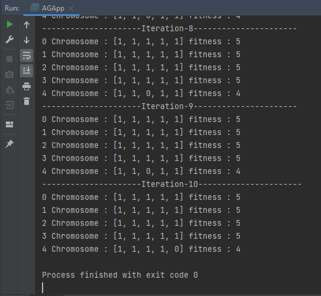

<h1>Distributed multi-agent system and AI </h1>
<h2 style="color: antiquewhite">GA implementation using MAS</h2>

  Asmae EL HYANI  Distributed System & Artificial Intelligence Master’s  ENSET Mohammedia

   

    
<ol type="I">
  <h2><li >Sequential implementation </li></h2>
<ul type="square">
<h2><li>Individual</li> </h2>

This class content the genes of 5 variable of 1 and 0, the fitness variable is the number of the ones in genes 

<pre>
public class Individual implements Comparable {
    //chromosome
    private int genes[]=new int[5];
    private int fitness;
    public Individual(){
        Random rnd=new Random();
        for(int i = 0; i< genes.length; i++){
            genes[i]=rnd.nextInt(2);
        }
    }
    public void calculateFitness(){
        fitness=0;
        for(int gene: genes){
            fitness+=gene;
        }
    }
    @Override
    public int compareTo(Object o) {
        Individual individual=(Individual) o;
        if(this.fitness>individual.fitness)
            return 1;
        else if (this.fitness<.individual.fitness)
            return -1;
        return 0;
    }
    public int getFitness() {
        return fitness;
    }
    public void setGenes(int[] genes) {
        this.genes = genes;
    }
    public void setFitness(int fitness) {
        this.fitness = fitness;
    }
    public int[] getGenes() {
        return genes;
    }
}
</pre>
<h2><li>Population</li> </h2>

<pre>
public class Population {
    private static final int MAX_IND = 5;
    List<.Individual> individuals = new ArrayList<>();
    Individual firstFinest;
    Individual secondFinest;
    Random random = new Random(4);
    public void initializePopulation() {
        for (int i = 0; i < MAX_IND; i++) {
            individuals.add(new Individual());
        }
    }
    public void calculateIndividualFitness() {
        for (int i = 0; i < MAX_IND; i++) {
            individuals.get(i).calculateFitness();
        }
    }
    public void selection() {
        firstFinest = individuals.get(0);
        secondFinest = individuals.get(1);
    }
    public void sortPopulation() {
        Collections.sort(individuals, Collections.reverseOrder());
    }
    //croisement
    public void crossover() {
        int pointCroisement = random.nextInt(MAX_IND-2);
        pointCroisement++;
        Individual individual1 = new Individual();
        Individual individual2 = new Individual();
        for (int i = 0; i < individual2.getGenes().length; i++) {
            individual1.getGenes()[i] = firstFinest.getGenes()[i];
            individual2.getGenes()[i] = secondFinest.getGenes()[i];
        }
        for (int i = 0; i < pointCroisement; i++) {
            individual1.getGenes()[i] = secondFinest.getGenes()[i];
            individual2.getGenes()[i] = firstFinest.getGenes()[i];
        }
        individuals.set(individuals.size() - 1, individual1);
        individuals.set(individuals.size() - 2, individual2);
        individual1.calculateFitness();
        individual2.calculateFitness();
    }
    public void mutation() {
        int index = random.nextInt(MAX_IND);
        if (individuals.get(individuals.size() - 1).getGenes()[index] == 1){
            individuals.get(individuals.size() - 1).getGenes()[index] = 0;
        } else{
            individuals.get(individuals.size() - 1).getGenes()[index] = 1;
        }
        individuals.get(individuals.size() - 1).calculateFitness();
    }
    public Individual getBestFitnessInd() {
        return individuals.get(0);
    }
}
</pre>
<h2><li>Application</li> </h2>

<pre>
public class AGApp {
    private static final int MAX_IT=10;
    private  static final int MAX_FITNESS=10;
    public static void main(String[] args) {
        Population population=new Population();
        population.initializePopulation();
        population.calculateIndividualFitness();
        population.sortPopulation();
        //show fitness
        for(int i=0;i<,population.individuals.size();i++){
            System.out.println(i+" Chromosome : "+ Arrays.toString(population.individuals.get(i).getGenes())+" fitness : "+population.individuals.get(i).getFitness());
        }
        int it=0;
        while (it<,MAX_IT&& population.getBestFitnessInd().getFitness()<,MAX_FITNESS){
            System.out.println("---------------------Iteration-"+(it+1)+"----------------------");
            population.selection();
            population.crossover();
            population.sortPopulation();
            Random random=new Random();
            if(random.nextInt(101)<50)
                population.mutation();
            population.calculateIndividualFitness();
            population.sortPopulation();
            for(int i=0;i<.population.individuals.size();i++){
                System.out.println(i+" Chromosome : "+ Arrays.toString(population.individuals.get(i).getGenes())+" fitness : "+population.individuals.get(i).getFitness());
            }
            it++;
        }
    }
}
</pre>
<h2><li>Test</li> </h2>

</ul>
</ol>